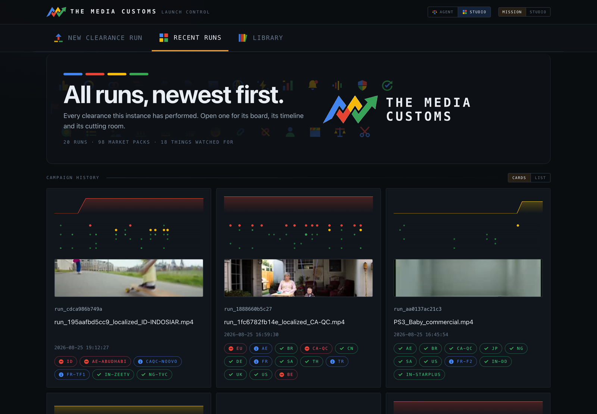
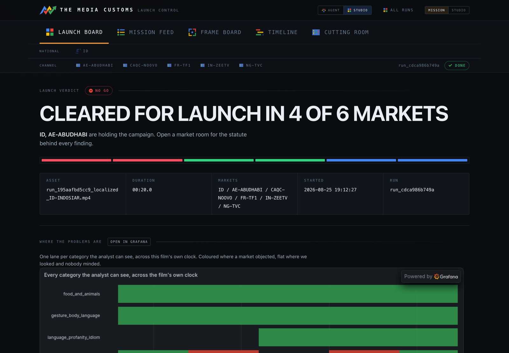
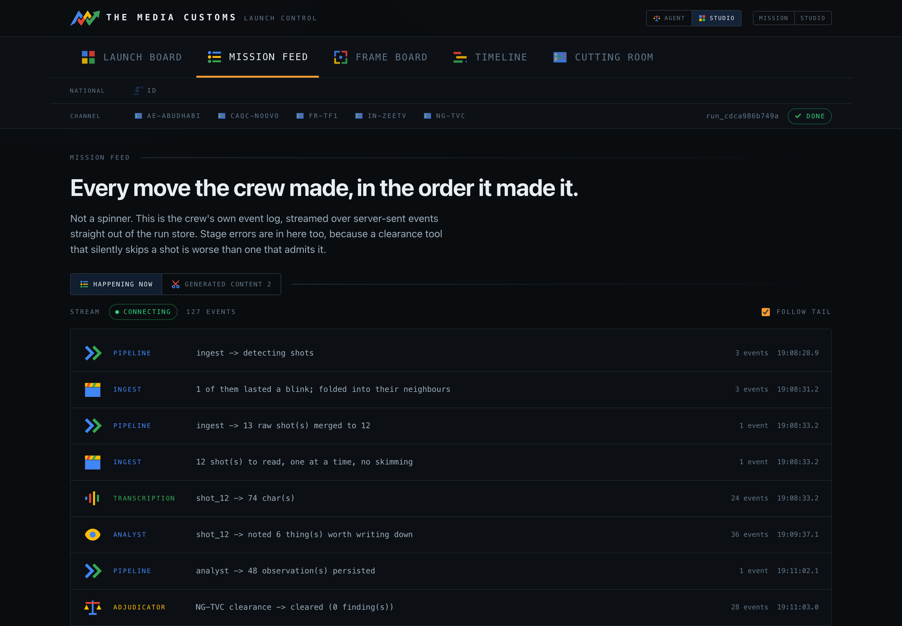
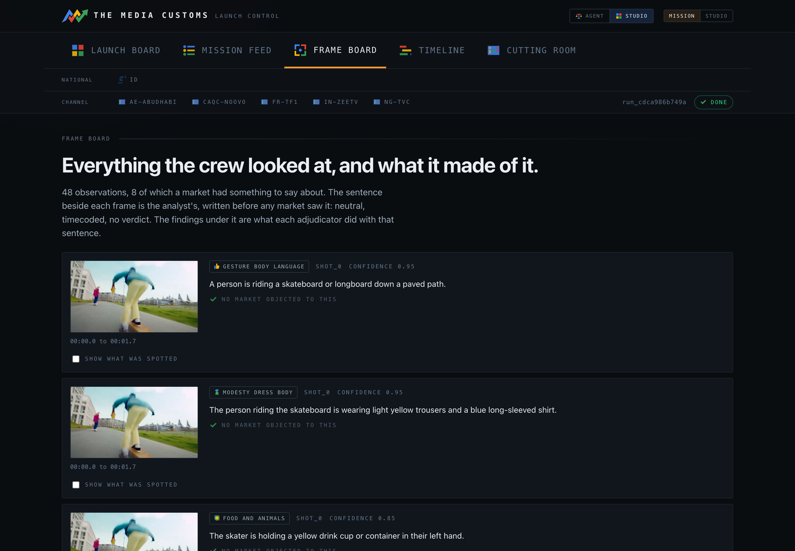
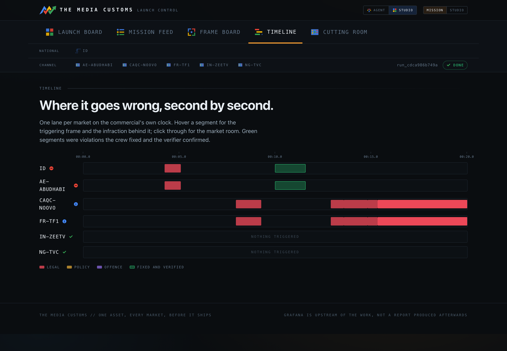
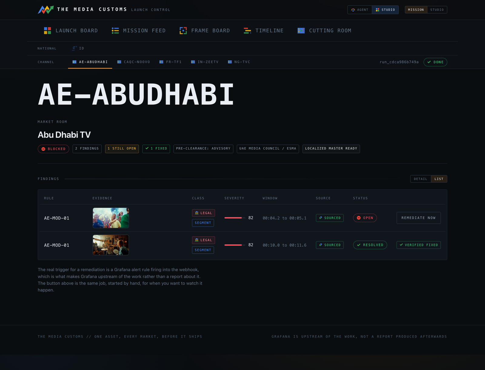
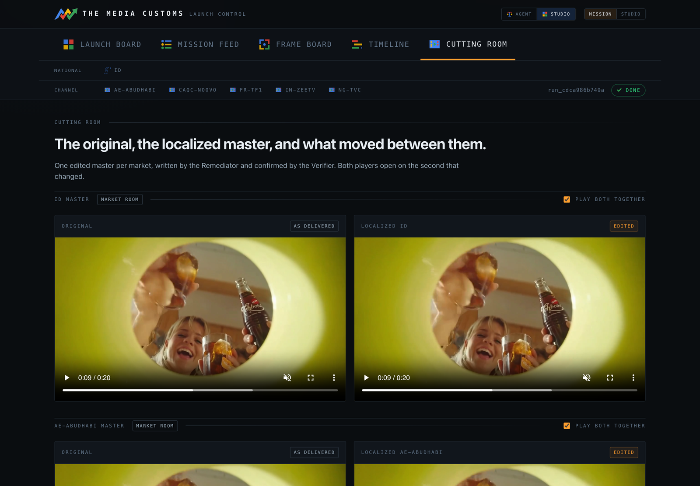
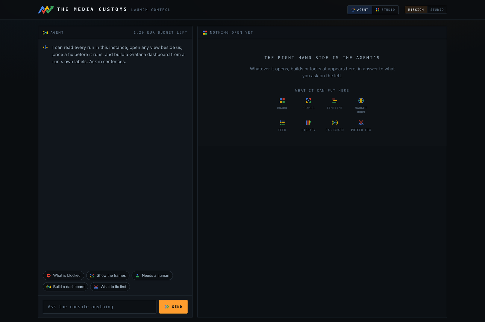
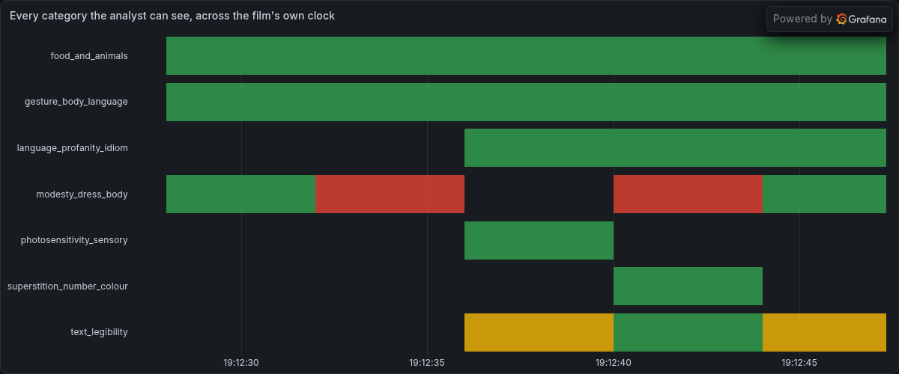

<p align="center">
  
</p>

<h1 align="center">The Media Customs</h1>

<p align="center">
  <strong>Agentic ad clearance.</strong><br>
  An AI crew watches your commercial once, judges it against the law of 98 jurisdictions in parallel,<br>
  builds its own Grafana instrument panel, and re-renders the shots that fail.
</p>

<p align="center">
  <a href="#quickstart"></a>
  
  
  
  
  <a href="LICENSE"></a>
</p>

<p align="center">
  Built for the <a href="https://agentic-cinema.devpost.com">Agentic Cinema</a> hackathon &mdash; <strong>Grafana Labs track</strong>.<br>
  <a href="https://customs-app-akap4ao72a-ew.a.run.app"><strong>Try the live instance &rarr;</strong></a>
</p>

---

## Contents

- [The problem](#the-problem)
- [What Customs does](#what-customs-does)
- [The core idea: observe once, judge many](#the-core-idea-observe-once-judge-many)
- [The console](#the-console)
- [Grafana is a participant, not a picture](#grafana-is-a-participant-not-a-picture)
- [Architecture](#architecture)
- [The jurisdiction ladder](#the-jurisdiction-ladder)
- [Remediation, and the loop that stops it wasting money](#remediation-and-the-loop-that-stops-it-wasting-money)
- [The Guard](#the-guard)
- [Agent declaration](#agent-declaration)
- [Quickstart](#quickstart)
- [Deployment](#deployment)
- [Tests](#tests)
- [Extending the market packs](#extending-the-market-packs)
- [Honest limits](#honest-limits)

---

## The problem

Global brands ship one commercial into dozens of markets and check maybe six of them.

France bans alcohol advertising under **Loi Évin**. Quebec bans advertising aimed at children under 13. Saudi Arabia's media regulator prohibits alcohol imagery outright. Thailand's lèse-majesté law makes a careless royal reference a criminal matter. The UK requires every TV ad to pass **Clearcast** before it airs.

And the unregulated half costs more than the regulated half. Pepsi and Kendall Jenner. Dolce &amp; Gabbana in China. H&amp;M's hoodie. None of those broke a statute. Each was caught by the public instead of by a process.

Customs is the instrument that catches it first.

| | Today | With Customs |
|---|---|---|
| **Coverage** | A handful of markets, by hand | 21 market packs resolving to **98 selectable jurisdictions** — global, EU, 16 countries, 80 broadcasters |
| **Evidence** | A consultant's opinion | A **named statute or code behind every finding**, and a live source link on every one that could be grounded — the rest are marked unsourced and capped |
| **Timeline** | Days to weeks | Minutes |
| **Monitoring** | A PDF report | A **Grafana instrument panel the crew builds and writes to itself** |
| **The fix** | Re-edit by an agency | Three fix tiers over five techniques, from a text re-letter to a **Veo-generated bridge** — priced in euro before you press |
| **The hard cases** | Silently "fixed" | A rule-layer **Guard** refuses to censor who appears in your ad, and surfaces it as a human decision with the statute cited |

---

## What Customs does

You upload a commercial (or paste a YouTube link), pick your markets, and watch it clear customs in real time.

```
  ingest ──▶ analyst ──▶ adjudicators ──▶ guard ──▶ publisher
    │           │         (parallel,        │          │
    │           │          one per          │          └─▶ Grafana
    │           │          jurisdiction)    │
    │           │                           └─▶ blocks auto-remediation
    │           └─▶ 18 dimensions, neutral,      on protected-basis rules
    │               timecoded, no verdicts
    └─▶ ffmpeg shot detection, audio split,
        transcription
```

Findings land as they are judged. Market tiles flip from pending to cleared, at risk or blocked. Every event the crew emits — every observation, every citation check, every MCP call to Grafana, every stage error — is on the mission feed as it happens.

Then, when a Grafana alert fires on a blocking finding, the **Remediator** wakes up and fixes the shot.

---

## The core idea: observe once, judge many

This is the architectural decision everything else follows from.

A multimodal **Analyst** watches the film **one time** and emits neutral, timecoded observations across [18 dimensions](markets/_taxonomy.yaml) — what is on screen, what is said, what gesture is made — and is forbidden from reaching a verdict. "A woman raises a glass of red wine in a toast" is an observation. "This violates Loi Évin" is not.

Then one **Adjudicator per selected jurisdiction** judges that single fact set against its own resolved rulebook, in parallel, grounding every citation with Google Search.

A finding is therefore always a **join**:

```
finding  =  observation  ×  market rule  ×  citation
```

That has three consequences worth the whole design:

1. **The expensive part happens once.** Adding the 40th market costs one batched text call against facts already extracted — plus one grounded citation check per finding it actually raises — not another pass over the video.
2. **Disputes decompose.** When a brand challenges a finding, *"is this fact wrong"* and *"is this rule wrong"* become separable questions with separable answers.
3. **The negative space is visible.** Because every observation is recorded against every rule of that market sharing its dimension — the acquittals included — Customs can answer *"what did every market look at and accept?"*, which findings alone can never show. A lane thick with cleared observations and one red band says **"we look at this constantly and it is almost always fine"**.

Verdicts are seeded as `unreturned` before the judge runs, so a pairing the model silently skipped stays visible instead of being indistinguishable from an acquittal. The judge runs at `temperature=0.0`.

---

## The console

Ten server-rendered screens. FastAPI, Jinja2, one stylesheet, one script — **no build step, no bundler, no CDN**.

Every screen renders its content on the server: the board shows the state it had when the page was served, the mission feed shows a server-rendered backlog, and the cutting room is two ordinary `<video>` elements. Agent mode, the feed's Generated-content tab and the frame board's evidence overlay are the client-side exceptions.

### Recent runs

The archive — every run this store holds, newest first. Cards or list, your choice, remembered per browser.



### Launch board

One tile per jurisdiction on the run, sorted blocked → at risk → error → pending → cleared. The verdict is go or no-go. The chart underneath is a **live Grafana panel** (see below), and the tiles carry Grafana-fed stat cards drawn in the app's own palette.



### Mission feed

The crew's own event log over server-sent events, resumable from `Last-Event-ID`. Two tabs: **Happening now**, and **Generated content** — every still and clip any model produced for the run.

A clearance tool that silently skips a shot is worse than one that admits it, so stage errors are first-class events, not swallowed exceptions.



### Frame board

Every observation in timecode order, beside the analyst's neutral sentence, its dimension, and the per-market findings hung off it. Tick the box under a thumbnail and a green box is drawn over exactly what was spotted.



### Timeline

One lane per market on the asset's own clock, one segment per finding, with a hover card carrying the triggering frame, rule, class, severity and rationale. Resolved findings stay on the chart in the cleared colour — the record of what was fixed is part of the record.



### Market room

One jurisdiction in full: the regulator, the pre-clearance regime, and every finding with its statute, its evidence frame, its scope verdict and a **priced** fix picker. Where the Guard has taken auto-remediation off the table, the finding is presented as a human decision instead, with the reason stated.



That second row is the whole loop closing: a finding that was **resolved** and then **verified fixed** by a re-run of the Analyst and Adjudicator over the changed shot alone.

### Cutting room

The original and the localized master side by side, with a change record for every edit.

Here is the FR re-lettering the Remediator produced with Gemini image editing, triggered by a Grafana alert on a Loi Toubon finding:

| Before | After |
|---|---|
|  |  |



### Agent mode

The console's other half. Ask it anything — including questions nobody wrote a screen for.

The agent has nine tools over the console's own reads and actions, and two of them make it genuinely open-ended: `data_schema()` hands it the exact Loki streams and Mimir metrics that exist, and `query()` runs the LogQL or PromQL it writes against the live stack. `build_dashboard()` then composes a Grafana dashboard nobody wrote in advance and hands back a server-side render plus the real Grafana link.

The schema is the guardrail: the agent is told precisely what is queryable, so it cannot invent a metric.



---

## Grafana is a participant, not a picture

This is the Grafana Labs track, so the honest question is: *does Grafana do work here, or is it a screenshot at the end?*

Traffic runs in **three directions**.

### 1. The crew writes into Grafana

The **Publisher** is an ADK `LlmAgent` with five tools, three of which are raw [grafana/mcp-grafana](https://github.com/grafana/mcp-grafana) calls it makes itself with arguments it chooses. It provisions **7 dashboards / 22 panels**, then searches the stack, fetches the overview dashboard, and **writes its own prose summary of the run into the dashboard description** — real model output, landing in Grafana, on every run that reaches the MCP server — and when it cannot, the stage degrades to HTTP and says so rather than failing the run.

What gets written:

| Surface | Contents |
|---|---|
| **Mimir** (OTLP) | 4 gauges — `customs_risk{asset,market,dimension}`, `customs_market_status{asset,market}`, `customs_blocking{asset,market,rule_id}`, `customs_stage_error{asset,stage}` |
| **Loki** (push API) | 3 line kinds — `kind="finding"`, `kind="observation"`, `kind="verdict"` |
| **Annotations** | Every finding, and every remediation that resolves one, tagged `[customs, asset, market, rule_id, finding_id]` |
| **Alert rules** | 2, both on wall-clock metrics, routed by `team=customs` to one webhook contact point |

Two details that took real work:

**Two clocks, never mixed.** `customs_risk` is written on a *mapped clock* where `t0 = push_time − duration`, so **wall-clock second `t0+n` is video second `n`** and Grafana's time axis becomes the film's timecode for free. Every other metric is stamped at real time. The backdate window was measured live rather than assumed — samples at −10m through +90s were all accepted — and since Mimir accepted a sample backdated a full 600 s, the ~240 s this formula ever needs is comfortably inside it. Every sample lands at or before push time, because `t0 = push_time − duration`.

**Labels versus body, as a cardinality decision.** Only low-cardinality, group-by-able fields become Loki stream labels. Everything else goes in the JSON body, reachable with `| json`, costing nothing in the index. A finding line carries all 20 fields of the `Finding` dataclass, so no query ever needs to join back to SQLite.

### 2. Grafana triggers the crew

An alert rule fires a webhook into the Cloud Run service. `POST /webhook/alert` reads `alerts[].labels`, requires the `{asset, market, rule_id}` triple, looks up the open finding, and schedules remediation.

**Grafana sits upstream of the work, not in a report after it.**

### 3. The crew reads Grafana back

Grafana is the console's data path, not just its output:

- The **lane chart** is a Loki query — `{app="customs", kind="observation", asset="…"} | json`, windowed to the run's own clock, with the run store as the fallback when Grafana is unreachable.
- The **run sparklines** are Mimir range queries over the run's mapped window, and so is the line behind each **market stat card** — though that card's headline number is the market's peak severity out of the run store.
- **Agent mode** queries both live, in whatever shape the operator asks for.

When the Verifier confirms a fix, the metric drops and Grafana resolves its own alert.

### Where the problems are — a real Grafana panel

The big lane chart on the launch board **is** `customs-lanes`, a Grafana state timeline: one lane per dimension over `max by (dimension) (max_over_time(… | unwrap max_severity))`, rendered inside Grafana with the service account, coloured by the thresholds in [state.py](src/customs/state.py). The chip beside it opens the identical panel on the stack.

<p align="center"></p>

Green is a category the analyst looked at and no market objected to. Amber is at risk. Red blocks. **The flat green is the point** — it is the evidence of everything that was checked and cleared, which no findings list contains.

### Why nothing here is an `<iframe>`

Every Grafana visual in this console is an image, and that is not a preference.

Grafana Cloud refuses to be framed by **both** mechanisms — but not on the same request, which is exactly why this is easy to get wrong:

```
GET   (what a browser's iframe issues)    csp: frame-ancestors 'none'
                                          x-frame-options: absent
HEAD  (what you reach for by hand)        csp: absent
                                          x-frame-options: deny
```

So the refusal that decides it is the CSP directive, and a header dump taken with `HEAD` will tell you there is no `frame-ancestors`. There is. [scripts/probe_framing.py](scripts/probe_framing.py) is checked in because this repo got it wrong twice, in both directions.

It matters because `frame-ancestors` *can* name permitted origins: `'none'` is a decision, not an absence, and on self-hosted Grafana it is exactly what `allow_embedding = true` relaxes. On a Cloud stack it is not ours to relax — `PUT /api/admin/settings` answers **403**. Public dashboards, which exist to be embedded, are refused on the same terms.

So the console uses two mechanisms instead:

| Mechanism | Used for | Why |
|---|---|---|
| **Server-side PNG render** | The lane panel, clearance and timeline panels | It is Grafana's own picture, made with Grafana's own renderer |
| **App-drawn SVG from Grafana's numbers** | Card strips, sparklines, market stat cards | Grafana Cloud's renderer floors a panel at 1000×500 — more than twice the height a card gives it |

Both are fed by the same queries and the same four-colour palette, defined once in [`state.py`](src/customs/state.py). A test asserts that **every colour literal in all seven dashboards** is one of those four, so a lane cannot be amber in Grafana and red on the tile beside it.

Charts are their own URLs, fetched lazily, cached on disk. Building them inline meant one Loki round trip per run before a byte of HTML went out:

| | Inline | Lazy |
|---|---|---|
| `/runs`, 20 runs | **2 min timeout** | **~0.17 s** |
| Launch board | 36.8 s | ~0.15 s |

*Measured end to end against the deployed instance over the public URL, so the network is in the number; the charts arrive after the page.*

---

## Architecture

```mermaid
flowchart TB
    U([Operator]) -->|upload / YouTube| APP[Launch Control<br/>FastAPI + Jinja2 + SSE]
    APP --> CREW

    subgraph CREW["ADK SequentialAgent · customs_crew"]
        direction TB
        I[ingest<br/>shots · audio · transcript] --> A[analyst<br/>keyframes · 18 dimensions<br/>no verdicts]
        A --> P{{ParallelAgent<br/>adjudicators}}
        P --> G[guard<br/>pure rules, no model]
        G --> PUB[publisher<br/>LlmAgent + MCP]
    end

    PUB -->|OTLP| MIMIR[(Mimir)]
    PUB -->|push API| LOKI[(Loki)]
    PUB -->|MCP · stdio| GRAF[Grafana Cloud<br/>7 dashboards · 2 alert rules]
    MIMIR --> GRAF
    LOKI --> GRAF

    GRAF -->|alert webhook| APP
    APP -->|schedules| REM[Remediator<br/>5 methods]
    REM --> VER[Verifier<br/>re-runs changed shots only]
    VER -->|metric drops| GRAF
    GRAF -->|queries| APP

    style CREW fill:#0d1117,stroke:#4285F4
    style GRAF fill:#0d1117,stroke:#F46800
    style REM fill:#0d1117,stroke:#EA4335
```



| Component | Role | Where |
|---|---|---|
| **Ingest** | ffmpeg shot detection, audio split, flash detection, Gemini transcription | [media.py](src/customs/media.py) |
| **Analyst** | one multimodal pass per shot, neutral observations across 18 dimensions, verdicts forbidden | [analyst.py](src/customs/analyst.py) |
| **Adjudicators** | one per jurisdiction, observations × resolved rulebook, Google Search grounding | [adjudicate.py](src/customs/adjudicate.py) |
| **Guard** | pure rule layer, blocks remediation on protected-basis and offence-class findings, **cannot be prompted away** | [guard.py](src/customs/guard.py) |
| **Publisher** | metrics, logs, annotations, dashboards and alert rules — the three MCP calls are the model's own | [telemetry.py](src/customs/telemetry.py), [grafana_ops.py](src/customs/grafana_ops.py) |
| **Remediator** | five methods on Gemini image editing, Gemini TTS, Veo 3.1 and ffmpeg | [remediate.py](src/customs/remediate.py) |
| **Verifier** | re-runs Analyst and Adjudicator on the changed shots only, reopens or resolves | [verify.py](src/customs/verify.py) |
| **Crew wiring** | the ADK agent graph | [crew.py](src/customs/crew.py) |
| **Console agent** | the second ADK agent: nine tools, free-form LogQL/PromQL | [agentmode.py](src/customs/agentmode.py) |
| **Market packs** | 21 YAML packs, 128 rules, resolved into 98 jurisdictions | [markets/](markets/) |
| **Launch Control** | 10 screens, SSE, the alert webhook | [app.py](src/customs/app.py), [templates/](src/customs/templates/) |
| **Dashboards** | the 7 definitions the Publisher provisions | [grafana/dashboards/](grafana/dashboards/) |
| **Run store** | SQLite, WAL, mirrored to Cloud Storage | [store.py](src/customs/store.py), [persist.py](src/customs/persist.py) |
| **Test ad generator** | a Veo-generated commercial with 8 documented landmines | [make_test_ad.py](scripts/make_test_ad.py), [landmines.yaml](docs/samples/landmines.yaml) |

**10,280 lines** of application Python against **8,039 lines** of tests.

---

## The jurisdiction ladder

A market is a YAML file, not code — but markets are not a flat list either. They **inherit**.

```
GLOBAL  (ICC Advertising & Marketing Code)
  └── EU  (AVMSD)
        └── BE  (Belgian national rules)
              └── BE-VRT  (the broadcaster's own standards)
```

VRT is judged against **12 rules**: its own 2, Belgium's 4, the EU's 3, and the global baseline's 3. Nobody wrote those 12 anywhere — the ladder resolves them.

| | Count |
|---|---|
| Pack files | **21** |
| Rules written | **128** |
| Selectable jurisdictions after resolution | **98** — 1 global, 1 continental, 16 national, 80 channel |
| Observation dimensions | **18** |
| Rule classes | 94 `legal`, 25 `policy`, 9 `offence` |
| Rules with a named statute or code in `basis` | **119** — the other 9 are the offence-class rules, whose basis states plainly that no statute exists |

Severity runs 20 (`US-HUM-01`, a humour-tone note) to 95 (`FR-ALC-01` Loi Évin, `TH-ROYAL-01` lèse-majesté, `SA-ALC-01`, `EU-TOB-01`, `DE-NAT-01`, `UK-TOB-01`). **70 blocks. 40 notes.**

---

## Remediation, and the loop that stops it wasting money

The operator picks a **tier**, and the Remediator picks the technique.

| Tier in the console | What it does | Cost |
|---|---|---|
| **Patch one frame** | edits a single frame and holds it over the span | €0.04 |
| **Track and propagate** | one clean frame warped across the span with optical flow | *not built — always shown, always disabled* |
| **Regenerate with Veo** | both ends of the span edited, then **Veo 3.1 generates the motion between them** | €1.88 – €3.68 |

Behind the patch tier the Remediator chooses one of four techniques by the finding's dimension — `relettering` (on-screen text re-lettered in the market's language), `prop_swap` (the object replaced in place), `revoice` (the line re-voiced with Gemini TTS), or `reframe` (an ffmpeg centre crop, the default when nothing else fits). `bridge` is the fifth.

**Scope no longer closes doors.** A guess about what shape of violation this "is" used to disable most of the picker. Now that guess rides along as a *caveat* — the sentence explaining why a technique is a poor fit for a violation of this shape — and the operator decides. `available` reflects only what genuinely cannot run: an unimplemented method, a span longer than Veo will generate, or a price the day's budget will not cover.

### The prompt is driven by what was actually spotted

The bridge prompt is deliberately task-free and constant — *provenance, not prohibition*. What varies is the frame instruction, resolved from **intent → replacement → dimension default**, so the fix that goes to Gemini is the fix for *this* finding. An earlier version hardcoded an alcohol substitution and cheerfully added a green drinking can to a shot whose problem was sleeve length.

Veo is also told to change what is there and not to invent what is not: it is bridging two frames that are already correct.

### The safety loop

Veo is the only expensive call in the system, so it is the last one made.

```
edit head anchor ──▶ ask Gemini: is the problem gone?  ──┐
edit tail anchor ──▶ ask Gemini: is the problem gone?  ──┤
                                                         ▼
                        both clean?      ──▶ call Veo        (€1.88–€3.68)
                        an anchor fails? ──▶ retry that one anchor, then stop
                                             (2–3 image edits, ~€0.08–€0.12,
                                              none of it billed to the budget)
                        checker itself
                        errors?          ──▶ proceed unchecked, and say so
                                             on the mission feed
```

That last branch is deliberate: the check **fails open**. A safety loop that turns a transient API error into a refusal to work is a worse tool than one that says on the record that it could not look.

A Veo generation the model refuses on safety grounds is **not charged**: the spend is deferred until Veo is actually called, and a refusal is retried once for free.

**Veo** runs against a **€20/day budget** — it is the only thing metered, because it is the only thing that costs real money — reset at midnight UTC, and the console shows what is left in euro *before* you press. That is between 5 and 10 bridges a day depending on span.

---

## The Guard

Some markets have rules about **who may appear** in an advertisement.

Customs will tell you that. It will not act on it.

The Guard is a **pure rule layer with no model call in it**. It reads exactly two pack-authored fields — a rule's `protected_basis: true`, and a finding's `offence` class — and when either applies, auto-remediation comes off the table and the finding is surfaced in the market room as a human decision with the statute cited. Two rules carry the flag today (`AE-LGBT-01`, `SA-LGBT-01`), alongside 9 offence-class rules.

Both inputs are written by whoever authored the pack. Neither is model output, so **the Guard cannot be prompted away.**

This is deliberate friction. A tool that quietly edits a person out of your commercial because a jurisdiction prefers it is not a compliance tool.

---

## Agent declaration

**Coded agents, built on Google ADK** (`google-adk`, Python 3.12).

The clearance crew is an ADK `SequentialAgent` named `customs_crew`:

```
ingest → analyst → ParallelAgent(adjudicators) → guard → publisher
```

`adjudicators` is a real ADK `ParallelAgent` holding one `AdjudicatorAgent` per selected market. The Publisher stage wraps an `LlmAgent` carrying five `FunctionTool`s, three of which are live Grafana MCP calls the model issues itself. A **second** ADK agent — the console agent in [agentmode.py](src/customs/agentmode.py) — carries nine tools and answers free-form analytical questions against Loki and Mimir.

Models, all Google:

| Model | Used for |
|---|---|
| `gemini-3.7-flash` | vision (per-shot observation), transcription, judging, grounded citations, both agents |
| `gemini-3.1-flash-image` | frame editing — re-lettering, prop swaps, bridge anchors |
| `veo-3.1-generate-001` | the bridge method, and generating the test commercial |
| `gemini-2.5-flash-tts` | re-voicing |

The Publisher reaches Grafana through the self-hosted [grafana/mcp-grafana](https://github.com/grafana/mcp-grafana) v1.1.0 server over stdio; the console agent uses MCP for dashboard writes and reads Loki and Mimir over the datasource proxy. Transport per operation is decided **once at construction from the live MCP tool inventory**, and falls back to REST for the three operations mcp-grafana 1.1.0 has no write tool for.

No Anthropic, OpenAI, AWS or Microsoft model, agent framework or AI API appears anywhere in this project. Source and the pinned requirements are held to that by a test: [tests/test_no_forbidden_vendors.py](tests/test_no_forbidden_vendors.py).

---

## Quickstart

**Prerequisites**

- Python 3.12
- ffmpeg on `PATH` (`brew install ffmpeg` / `apt-get install ffmpeg`)
- A Google Cloud project with Vertex AI enabled, and `gcloud auth application-default login` done
- A Grafana Cloud stack (the free tier is enough): one service account token (role Admin), and one access policy token with `metrics:write` and `logs:write`
- The [mcp-grafana v1.1.0 binary](https://github.com/grafana/mcp-grafana/releases/tag/v1.1.0) for your platform at `bin/mcp-grafana` — resolution order is `$MCP_GRAFANA_BIN`, then `bin/mcp-grafana`, then `/usr/local/bin/mcp-grafana`. The Docker image installs its own.

```bash
git clone https://github.com/tdries/td-devpost-agentic-cinema.git
cd td-devpost-agentic-cinema

# 1. Environment
python3.12 -m venv .venv
.venv/bin/pip install -r requirements.txt
cp .env.example .env        # see the note below before you run anything

# 2. Provision the Grafana surface — 7 dashboards, 2 alert rules,
#    the webhook contact point, the public share links. Idempotent.
PYTHONPATH=src .venv/bin/python scripts/provision_grafana.py

# 3. Clear an ad from the terminal
PYTHONPATH=src .venv/bin/python scripts/run_pipeline.py docs/samples/test_ad.mp4 FR SA US

# 4. Or run Launch Control and use the browser
PYTHONPATH=src .venv/bin/uvicorn customs.app:app --reload
# http://127.0.0.1:8000
```

> **Read `.env.example` before step 2.** Three values are blank and required — `GRAFANA_SA_TOKEN`, `GRAFANA_CLOUD_TOKEN`, `GOOGLE_CLOUD_PROJECT`.
>
> Five more are **pre-filled and point at our stack**: `GRAFANA_URL`, `GRAFANA_STACK_ID`, `LOKI_USER`, `OTLP_URL`, `LOKI_PUSH_URL`. Replace all five with your own, or `provision_grafana.py` will happily try to write dashboards into someone else's Grafana. They are pre-filled because this is a hackathon entry meant to be run against the instance in the demo, not because they are defaults.

### The test ad

The demo commercial was generated with Veo and deliberately loaded with **7 documented landmines** — a wine toast, English-only on-screen text, a thumbs-up straight down the lens, beach swimwear, a strobe transition, a comparative claim and a same-sex couple — plus one clean control shot that should trip nothing.

[docs/samples/landmines.yaml](docs/samples/landmines.yaml) is the ground truth; the gate run against it is recorded in [milestone1-gate.md](docs/superpowers/plans/milestone1-gate.md).

Google's own tools made the ad, and then failed it.

---

## Deployment

One idempotent script. Cloud Run, single instance, secrets in Secret Manager, state on a mounted Cloud Storage bucket.

```bash
scripts/deploy.sh          # full: APIs, secrets, IAM, Grafana wiring, build, deploy
FAST=1 scripts/deploy.sh   # code-only: skips everything that has to be true once
```

`FAST=1` exists because the once-only preamble is most of the wall clock. The build uses [cloudbuild.yaml](cloudbuild.yaml) with `--cache-from` layer caching on an `E2_HIGHCPU_8` machine, and the Dockerfile is ordered so an ordinary source edit invalidates only `COPY src/` and below.

Runtime: `--max-instances 1 --min-instances 1 --concurrency 20 --memory 2Gi --cpu 2 --timeout 900`, with the state bucket mounted at `/mnt/state`.

**Runs survive a deploy.** SQLite is never opened on the GCS FUSE mount — the live database is copied out with sqlite3's own backup API to a local temp file, and only the finished file crosses as plain bytes. Keyframes are mirrored too, because every observation points at one as its evidence and a restored run without them comes back with its findings intact and its proof missing.

---

## Tests

```bash
.venv/bin/python -m pytest -q        # 446 passed, 8 deselected
.venv/bin/python -m pytest -m live   # the 8: real Gemini, real Grafana
```

454 collected, 446 offline, 8 marked `live`. ffmpeg must be on `PATH` — without it 85 tests error and 3 fail, which is the honest signal rather than a quiet skip.

---

## Extending the market packs

Copy any pack in [markets/](markets/). Give every rule:

| Field | |
|---|---|
| `id` | unique across all packs |
| `dimension` | one of the 18 in [_taxonomy.yaml](markets/_taxonomy.yaml) |
| `class` | `legal`, `policy` or `offence` |
| `severity` | 0–100; 70 blocks, 40 notes |
| `trigger` | what the adjudicator is looking for |
| `basis` | the real statute or code — or, for an `offence` rule, a plain statement that none exists |
| `protected_basis` | `true`, **honestly**, where the rule targets who someone is |

And at the top of the file, once: `market` (required), `name`, `level` (`global`, `continental`, `regional`, `national`, `subnational` or `channel`), **`parent`** (the jurisdiction it inherits from), `regulators`, `pre_clearance`.

Drop the file in `markets/` and the jurisdiction appears in the console on the next run. The Guard reads `protected_basis` and the rule's `class` — never model output — when it refuses to auto-remediate.

---

## Honest limits

- **The Guard is deliberate friction.** Customs will tell you a market requires censoring who appears in your ad, and it will not do that for you.
- **Unsourced findings are capped.** A finding whose citation cannot be resolved to a live source is marked `sourced: false`, capped at severity 40, never blocks a market, and never fires an alert — so it never triggers remediation on its own. An operator can still choose to act on one by hand.
- **Veo is budgeted, not unlimited.** €20/day system-wide, reset at midnight UTC. Veo will not generate a span longer than 8 s, and the console refuses the button rather than failing mid-generation. A span shorter than 4 s is rounded up to Veo's four-second minimum and priced accordingly.
- **Input caps.** 120 seconds and 200 MB, enforced at the door.
- **Single instance by design.** SQLite and in-process locks; Cloud Run runs `--max-instances 1`. Demo-grade persistence, stated as a tradeoff rather than hidden.
- **Nothing Grafana serves is interactive in the console.** Grafana Cloud cannot be framed, so its panels arrive as server-side renders. The "open in Grafana" links go to the real thing.
- **98 jurisdictions, not 195 countries.** Twenty-one packs with real citations beat a hundred and ninety-five without. The pack format is the extension point, and the ladder means a new broadcaster is two rules, not two hundred.

---

## License

[Apache-2.0](LICENSE)
</content>
</invoke>
