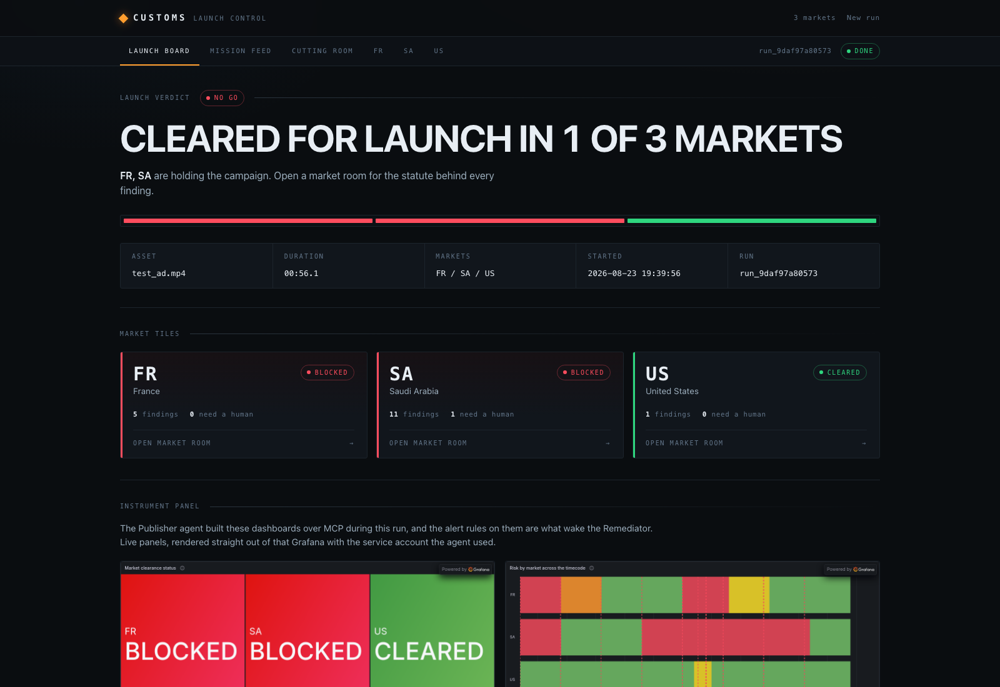
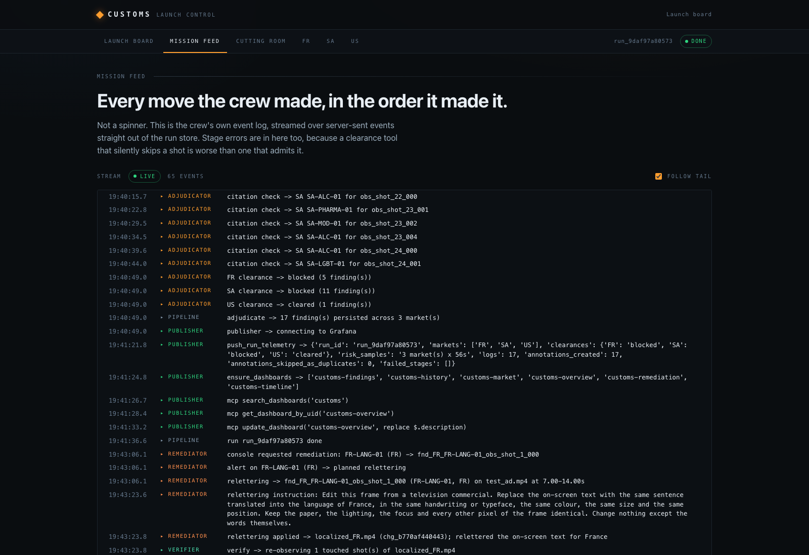
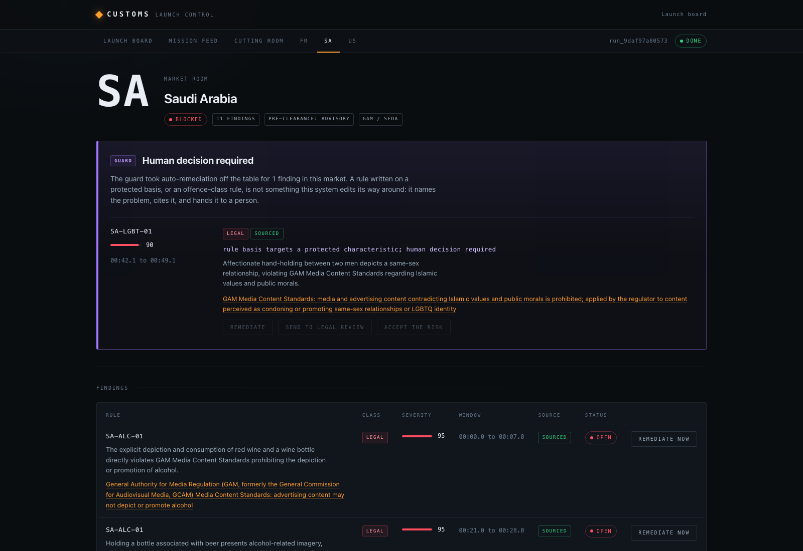

<p align="center">
  
</p>

<h1 align="center">Customs</h1>

<p align="center"><strong>Agentic ad clearance. An AI crew watches your commercial, judges it against the law of 15 markets, builds its own Grafana instrument panel, and re-renders the shots that fail.</strong></p>

<p align="center">
  <a href="https://youtu.be/YOUTUBE_VIDEO_ID"></a>
</p>

<p align="center">
  Built for the <a href="https://agentic-cinema.devpost.com">Agentic Cinema</a> hackathon, Grafana Labs track.<br>
  Live instance: <a href="https://customs-app-akap4ao72a-ew.a.run.app">customs-app-akap4ao72a-ew.a.run.app</a>
</p>

---

## Project description

Global brands ship one commercial into dozens of markets and check maybe six of them. France bans alcohol advertising on TV under Loi Evin. Quebec bans ads aimed at children under 13. Saudi Arabia's media regulator prohibits alcohol imagery outright. The UK requires pre-clearance of every TV ad through Clearcast. And the unregulated half costs even more: Pepsi and Kendall Jenner, Dolce & Gabbana in China, H&M's hoodie. Each of those was caught by the public instead of by a process.

Customs is the instrument that catches it first. You upload a commercial and a market list, and you watch it clear customs in real time:

| | Today | With Customs |
|---|---|---|
| Coverage | A handful of markets, manually | 15 markets in one run, extensible by YAML |
| Evidence | A consultant's opinion | A statute citation on every finding, checked against a live source |
| Timeline | Days to weeks | Minutes |
| Monitoring | A PDF report | A Grafana instrument panel the agent builds and updates itself |
| The fix | Re-edit by an agency | The Remediator re-letters, re-props and re-voices the failing shots, and a Verifier re-runs the same instrument to confirm the fix |
| The hard cases | Silently "fixed" | A rule-layer Guard refuses to censor who appears in your ad and hands it to a human, with the reason stated |

The core architectural decision is **observe once, judge per market**. A multimodal Analyst watches the film one time and emits neutral, timecoded observations. Fifteen per-market Adjudicators then judge that single fact set against their own rulebook in parallel, grounding every citation with Google Search. A finding is always a join: observation x market rule x citation. When a brand disputes one, "is this fact wrong" and "is this rule wrong" are separable questions.

### Launch Board

Fifteen market tiles flip from pending to cleared, at risk or blocked as adjudicators return. The verdict is go or no-go, and the embedded Grafana panels underneath are the ones the crew built for this run.



### Mission Feed

The crew's own event log over server-sent events. Every observation, every citation check, every MCP tool call, every stage error. A clearance tool that silently skips a shot is worse than one that admits it.



### Market Room

One market in full: regulator, pre-clearance regime, every finding with its statute and a live citation link. When a rule targets a protected characteristic, the Guard takes auto-remediation off the table and presents it as a human decision.



### Cutting Room

The original and the localized master side by side, with a change record for every edit. Here is the FR re-lettering the Remediator produced with Gemini image editing, triggered by a Grafana alert on the Loi Toubon finding:

| Before | After |
|---|---|
|  |  |


### Grafana is a participant, not a picture

Traffic runs in three directions:

1. **The crew writes into Grafana.** The Publisher creates and updates six dashboards and the alert rules over the Grafana MCP server, pushes `customs_risk` metrics to Mimir over OTLP, finding detail to Loki, and writes every finding as an annotation on the run's timeline.
2. **Grafana triggers the crew.** An alert rule fires a webhook into the Cloud Run service, which wakes the Remediator. Grafana sits upstream of the work, not in a report after it.
3. **The crew reads Grafana back.** Before remediating, the Remediator queries campaign history through MCP for prior findings on the same rule.

When the Verifier confirms a fix, the metric drops and Grafana resolves the alert on its own. That resolution is the demo's closing beat.

## Components

| Component | Role | Where |
|---|---|---|
| Ingest | ffmpeg shot detection, keyframes, audio split, Gemini transcription and OCR | [src/customs/media.py](src/customs/media.py) |
| Analyst | one multimodal pass per shot, neutral observations across 18 dimensions, no verdicts allowed | [src/customs/analyst.py](src/customs/analyst.py) |
| Adjudicators | one per market, observations x market pack, Google Search grounding for citations | [src/customs/adjudicate.py](src/customs/adjudicate.py) |
| Guard | pure rule layer, blocks remediation on protected-basis and offence-class findings, cannot be prompted away | [src/customs/guard.py](src/customs/guard.py) |
| Publisher | metrics to Mimir (OTLP), logs to Loki, dashboards, annotations and alert rules via Grafana MCP | [src/customs/telemetry.py](src/customs/telemetry.py), [src/customs/grafana_ops.py](src/customs/grafana_ops.py) |
| Remediator | re-lettering, prop substitution and re-voicing with Gemini image editing and TTS, woken by the Grafana alert webhook | [src/customs/remediate.py](src/customs/remediate.py) |
| Verifier | re-runs Analyst and Adjudicator on the changed shots only, reopens or resolves the finding | [src/customs/verify.py](src/customs/verify.py) |
| ADK crew wiring | the agent graph; the one module that imports google.adk | [src/customs/crew.py](src/customs/crew.py) |
| Market packs | 15 YAML packs, 114 rules, every rule with a statute or code in its basis | [markets/](markets/) |
| Launch Control console | FastAPI + Jinja2 + SSE, four screens, embedded Grafana panels, alert webhook | [src/customs/app.py](src/customs/app.py), [src/customs/templates/](src/customs/templates/) |
| Grafana dashboards | the six dashboard definitions the Publisher provisions | [grafana/dashboards/](grafana/dashboards/) |
| Run store | SQLite, one file per run, mission event bus | [src/customs/store.py](src/customs/store.py) |
| Pipeline CLI | end to end clearance from the terminal | [scripts/run_pipeline.py](scripts/run_pipeline.py) |
| Test ad generator | Veo-generated commercial with 8 documented landmines | [scripts/make_test_ad.py](scripts/make_test_ad.py), [docs/samples/landmines.yaml](docs/samples/landmines.yaml) |
| Deployment | Cloud Run, single instance, secrets in Secret Manager | [Dockerfile](Dockerfile), [scripts/deploy.sh](scripts/deploy.sh) |

## Agent declaration

**Coded agents, built on Google ADK** (`google-adk`, Python 3.12). The crew is `ingest -> analyst -> adjudicators (parallel, one per market) -> guard -> publisher`, wired in [src/customs/crew.py](src/customs/crew.py), with the Remediator and Verifier woken out of band by Grafana alert webhooks. Models are Gemini 3.x multimodal (vision, text, grounded citations), Gemini image editing for inpainting and re-lettering, Gemini TTS for re-voicing, and Veo for generating the test commercial. The Publisher and Remediator use the self-hosted [grafana/mcp-grafana](https://github.com/grafana/mcp-grafana) server over stdio for every dashboard, annotation, alert-rule and history operation.

No Anthropic, OpenAI, AWS or Microsoft model, agent framework or AI API appears at runtime or in the dependency tree. That contest rule is enforced by a test: [tests/test_no_forbidden_vendors.py](tests/test_no_forbidden_vendors.py).

## Setup

Prerequisites:

- Python 3.12
- ffmpeg on PATH (`brew install ffmpeg` / `apt-get install ffmpeg`)
- A Google Cloud project with Vertex AI enabled, and `gcloud auth application-default login` done
- A Grafana Cloud stack (free tier works): one service account token (role Admin) and one access policy token with `metrics:write` and `logs:write`
- The [mcp-grafana v1.1.0 release binary](https://github.com/grafana/mcp-grafana/releases/tag/v1.1.0) for your platform, unpacked to `bin/mcp-grafana` (resolution order is the `MCP_GRAFANA_BIN` env var, then `bin/mcp-grafana`, then `/usr/local/bin/mcp-grafana`; the Docker image installs its own)

Then, from a cold clone:

```bash
git clone https://github.com/tdries/td-devpost-agentic-cinema.git
cd td-devpost-agentic-cinema

# 1. Environment
python3.12 -m venv .venv
.venv/bin/pip install -r requirements.txt
cp .env.example .env        # fill in the Grafana and Google Cloud values

# 2. Provision the Grafana surface (six dashboards, two alert rules,
#    webhook contact point, public embeds). Idempotent.
PYTHONPATH=src .venv/bin/python scripts/provision_grafana.py

# 3. Run a clearance from the terminal
PYTHONPATH=src .venv/bin/python scripts/run_pipeline.py docs/samples/test_ad.mp4 FR SA US

# 4. Or run Launch Control and use the browser
PYTHONPATH=src .venv/bin/uvicorn customs.app:app --reload
# open http://127.0.0.1:8000

# 5. Tests (offline by default; -m live hits Gemini and Grafana for real)
.venv/bin/python -m pytest -q
```

Deploying to Cloud Run is one script, idempotent, secrets via Secret Manager:

```bash
scripts/deploy.sh
```

## The test ad

The demo commercial was generated with Veo and deliberately loaded with 8 documented landmines (wine toast, English-only on-screen text, beach swimwear, a strobe transition, a comparative claim, a same-sex couple, plus two control shots). [docs/samples/landmines.yaml](docs/samples/landmines.yaml) is the ground truth; the gate run against it is recorded in [docs/superpowers/plans/milestone1-gate.md](docs/superpowers/plans/milestone1-gate.md). Google's own tools made the ad, and then failed it.

## Extending the market packs

A market is a YAML file, not code. Copy an existing pack in [markets/](markets/), give every rule an `id`, a `dimension` from [markets/_taxonomy.yaml](markets/_taxonomy.yaml), a `class` (`legal`, `policy` or `offence`), a `severity`, a `trigger`, and a `basis` naming the real statute or code. Set `protected_basis: true` honestly where a rule targets who someone is; the Guard reads only that flag, never model output, when it refuses to auto-remediate. Drop the file in `markets/` and the market appears in the console on the next run.

## Honest limits

- **The Guard is deliberate friction.** Customs will tell you that a market requires censoring who appears in your ad, and it will not do that for you. Those findings are routed to a human with the statute cited.
- **Unsourced findings are capped.** A finding whose citation cannot be resolved to a live source is marked `sourced: false`, capped at severity 40, and never triggers remediation or blocks a market.
- **Input caps.** 120 seconds and 200 MB per upload, enforced at the door.
- **Single instance by design.** SQLite and in-process locks; Cloud Run runs `--max-instances 1`. Demo-grade persistence, stated tradeoff.
- **15 markets, not 195.** Fifteen packs with real citations beat a hundred and ninety-five without. The pack format is the extension point.

## License

[Apache-2.0](LICENSE)
