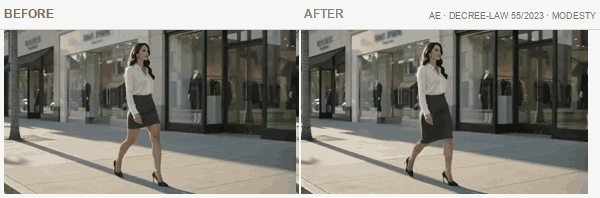
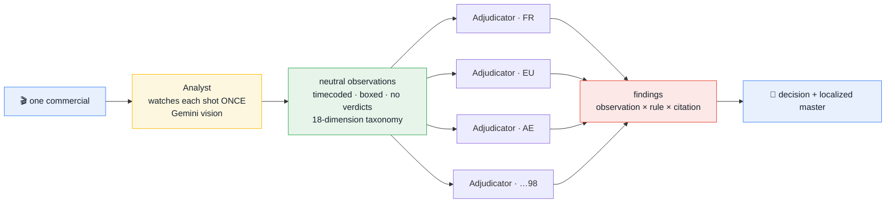
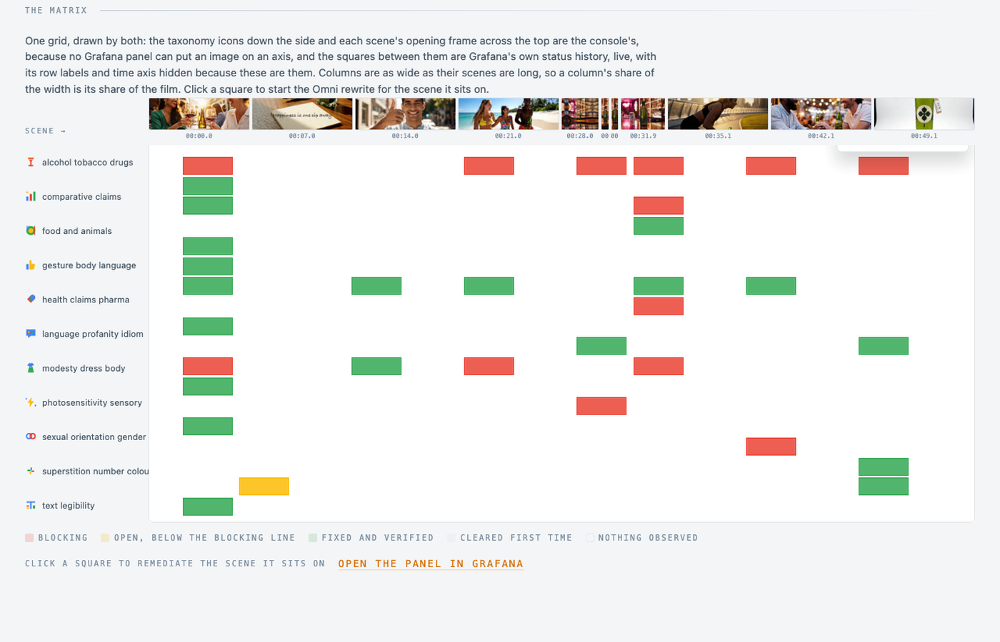
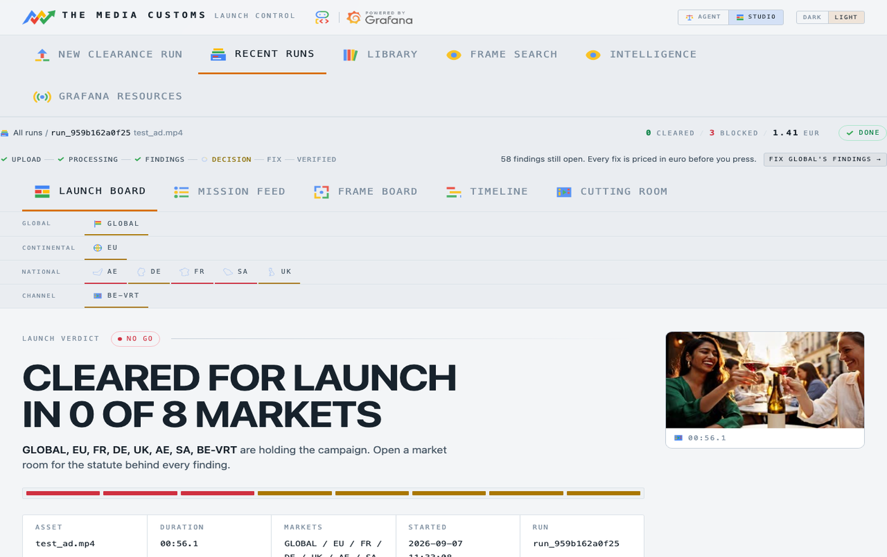
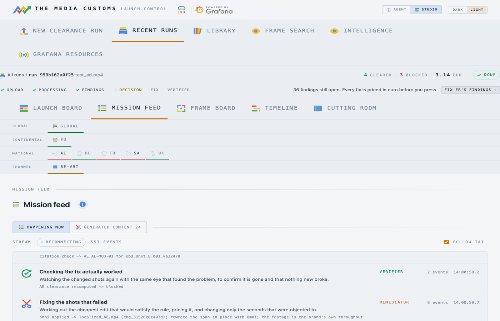
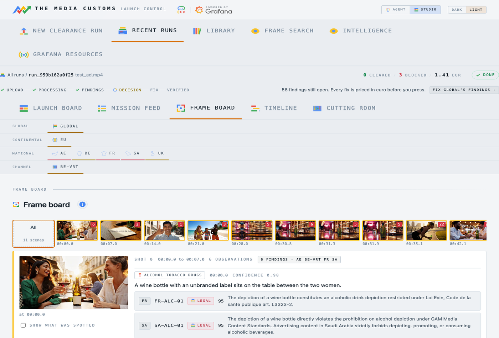
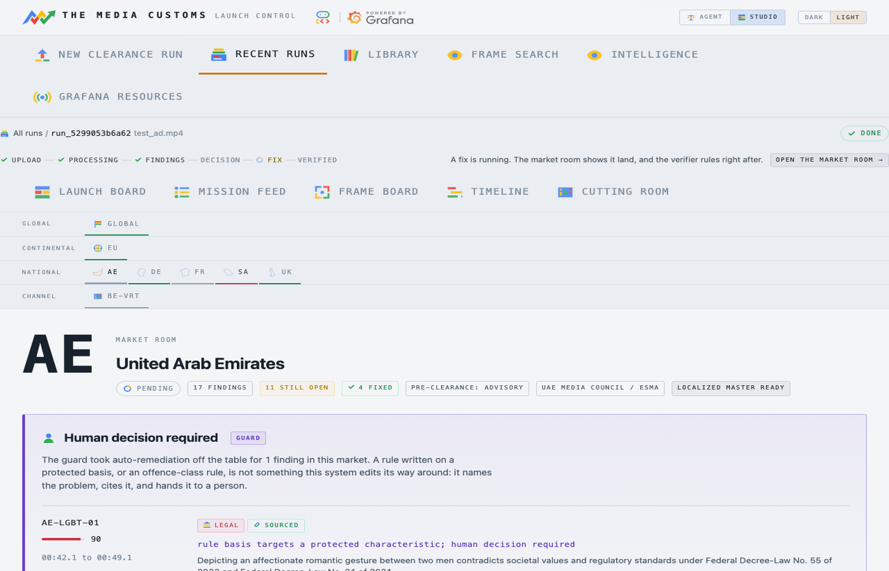
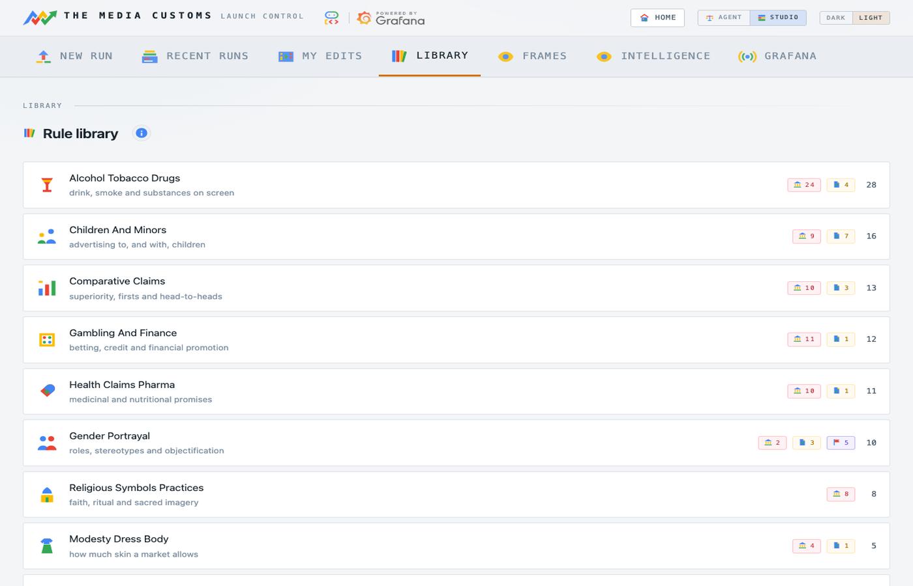
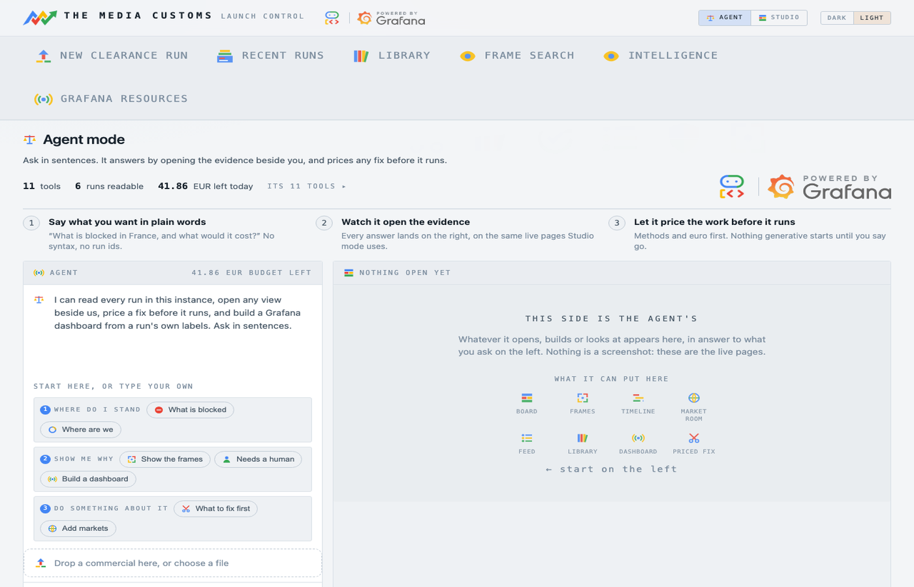
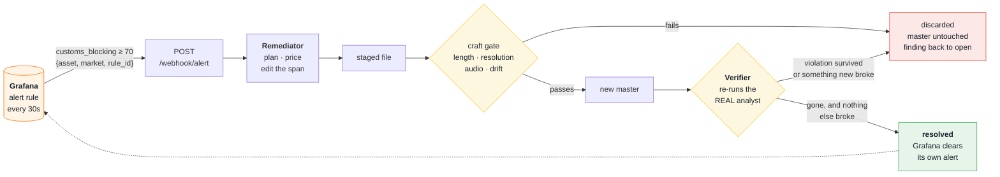

<div align="center">


### One asset, every market, before it ships.

**An AI crew watches your commercial once, judges it against 98 jurisdictions in parallel, builds its own Grafana instrument panel — and re-renders the shots that fail.**


[](https://customs-app-akap4ao72a-ew.a.run.app)
[](#tests)
[](#the-jurisdiction-ladder)
[](#the-jurisdiction-ladder)
[](#grafana-is-a-participant-not-a-picture)
[](LICENSE)

**[Open the live console →](https://customs-app-akap4ao72a-ew.a.run.app)**

</div>

---

## Watch a fix land

Three violations, found and repaired by the system itself. Left is what was uploaded; right is what came back. Every clip below is footage this project generated and then fixed with its own methods — no stock, no borrowed IP.

<table>
<tr><td width="100%">


**France · [Loi Évin](https://www.legifrance.gouv.fr/loda/id/JORFTEXT000000350971) · alcohol.** French law bans alcohol advertising on television outright. The wine becomes pale juice and the bottle becomes a carafe; the toast, the light and the laugh survive untouched.

</td></tr>
<tr><td width="100%">


**EU · [AVMSD art. 9](https://eur-lex.europa.eu/eli/dir/2010/13/oj) · tobacco.** A lit cigarette becomes an espresso cup, and every wisp of smoke leaves the frame. This one took two passes: the first edit held everywhere except the drag itself, which is exactly why the product re-watches every fix instead of trusting the model's word.

</td></tr>
<tr><td width="100%">



**UAE · [Federal Decree-Law 55/2023](https://uaelegislation.gov.ae/) · modesty.** The hemline drops to the knee in the same grey fabric, mid-stride, same street, same woman.

</td></tr>
</table>

> [!NOTE]
> These are the *marketing* clips, and they were held to the product's own standard. The first take of the skirt pair came back with legible Chanel storefronts in the background — third-party branding, on the homepage of a rights-clearance tool — so it was thrown away and regenerated with brands banned.

---

## The problem

A global brand ships one commercial into forty markets and checks maybe six of them.

The regulated half of the risk already carries an invoice: France bans TV alcohol advertising under Loi Évin, Quebec bans advertising aimed at children under 13, the UK pre-clears every TV ad through Clearcast, Nigeria requires ARCON vetting before air. The unregulated half costs more — Pepsi and Kendall Jenner, Dolce & Gabbana in China, H&M's hoodie. Every one of those was caught by the public rather than by a process.

Pilots get a pre-flight checklist and an instrument panel. Ad launches get a consultant, a focus group, and luck.

This is the instrument.

---

## What it does

Hand it a commercial — a file, or a YouTube link — and a market list, then watch it clear customs in real time.

<div align="center">


</div>

The output is two things: **a decision** (can this air here, and on what evidence) and **a localized master** (the version that can).

| | |
|---|---|
| **98 jurisdictions** | 21 market packs resolving to a global baseline, the EU, 16 countries and 80 broadcasters — 757 market-rule pairings once inheritance resolves |
| **128 rules** | every one naming a real statute, broadcaster code or cultural norm, with a live citation |
| **18 dimensions** | one fixed taxonomy the analyst emits and every rule is written against |
| **6 repair methods** | from a €0.04 single-frame patch to a €3.68 Veo-generated bridge, priced in euro before you press |
| **5 agents** | an ADK `SequentialAgent` named `customs_crew`, with the adjudicators fanned out in parallel |
| **1 refusal** | when a rule targets a protected characteristic, a rule-layer Guard refuses to auto-edit and hands it to a human |

---

## The core idea: observe once, judge many

The expensive part of this problem is *looking* at the film. The cheap part is *opinions* about what was seen.

So the system separates them, and never lets them mix:



A finding is always a **join**: *this observation* × *that market's rule* × *a citation that resolves*. Which makes "is this fact wrong?" and "is this rule wrong?" separable questions — and that is the whole reason findings are cheap, parallel and defensible.

The analyst is forbidden from expressing an opinion. It writes *"a woman raises a glass of red wine"*, never *"this violates French law"*. Ninety-eight adjudicators then argue about that one sentence, simultaneously, each holding a different rulebook.

---

## How a run actually works

Five stages, in order, from [`src/customs/crew.py`](src/customs/crew.py). The stage names below are the ones the code emits.

| # | Stage | Agent | What it does | What it writes |
|---|---|---|---|---|
| 1 | `ingest` | `IngestAgent` | ffmpeg shot detection, one Gemini audio call per shot, and a **measured** flash sweep — a strobe is a property of the sequence, not of any frame, so it is counted rather than asked about | shots, transcripts, photosensitivity observations |
| 2 | `analyst` | `AnalystAgent` | one Gemini vision call per shot, keyframes as image parts, the 18-dimension taxonomy in the prompt. Neutral sentences only — no verdicts | observations + bounding boxes + evidence frames |
| 3 | `adjudicators` | `AdjudicatorAgent` × N inside an ADK `ParallelAgent` | a pure dimension join against each market's YAML pack, then **one** batched Gemini call and **one** grounded Google Search citation per triggered rule. N markets cost one market's latency | a verdict for every candidate pairing, cleared ones included |
| 4 | `guard` | `GuardAgent` | reads the matched rule's metadata and nothing else — never the rationale, never a model-authored field. Runs after the fan-out joins, which makes it the single findings write | findings (the one write, on one thread) |
| 5 | `publisher` | `PublisherAgent` — the only `LlmAgent` | issues five tool calls itself, three of them live Grafana MCP, reads every result, decides what to do when one fails, and composes the prose it writes into the overview dashboard | Mimir series, Loki lines, annotations, dashboards, alert rules |


<details>
<summary><b>Stage by stage, with the file that does it</b></summary>

**1 · ingest** — `crew.IngestAgent`. `media.detect_shots` runs an ffmpeg scene-score ladder, `analyst.merge_micro_shots` folds away sub-second fragments. Then one Gemini audio call per shot for a transcript. Then `media.detect_flashes`, which is the one observation that is *measured* rather than asked of a model: it reads full-frame luminance and every window over 3.0 flashes/second becomes a photosensitivity observation. A vision model cannot see a strobe — a strobe is a property of the *sequence*, not of any frame — and this is exactly how the milestone gate once missed a planted 6 Hz strobe.

**2 · analyst** — `crew.AnalystAgent`. One Gemini vision call per shot, keyframes as image parts, the 18-dimension taxonomy interpolated into the prompt. Emits observations with bounding boxes and evidence frames. No verdicts allowed.

**3 · adjudicators** — `crew.AdjudicatorAgent` inside an ADK `ParallelAgent`, one per market, each on its own thread. N markets cost one market's latency, not N. Each does a pure dimension-equality join against its YAML pack, then **one** batched Gemini call, then **one** grounded Google Search citation per triggered rule. Severity, `sourced`, the citation, remediability and the finding id are all decided in code — the model may only adjust severity *downward*, clamped to [−20, 0]. An unresolvable citation caps severity at 40 and can never trigger remediation.

**4 · guard** — `crew.GuardAgent`. Runs after the parallel branch joins, which makes it the single place findings are written to SQLite, on one thread. See [The Guard](#the-guard).

**5 · publisher** — `crew.PublisherAgent`, the genuinely agentic stage: a `BaseAgent` wrapping an `LlmAgent` with five tools, three of which are live Grafana MCP calls. It issues each call itself, reads every result, decides what to do when one fails, and composes the prose it writes into the overview dashboard's description. That last step is a real MCP write, on every run, in words no template produced.

</details>

---

## Grafana is a participant, not a picture

This is the [Grafana Labs track](https://agentic-cinema.devpost.com/details/grafana-resources), and the requirement is that the project *actively use the Grafana stack at runtime, primarily through the Grafana Cloud MCP server*. It does — in **three directions**, and you can watch all three happen on the live instance.

> [!IMPORTANT]
> The MCP server is the official [`grafana/mcp-grafana`](https://github.com/grafana/mcp-grafana) **v1.1.0**, run as a stdio subprocess with a service-account token. Grafana's own documentation notes the *hosted* Cloud MCP endpoint "authenticates users interactively — there is no service-account or machine-token option." This crew is unattended, so the open-source server is the documented correct choice, not a workaround.

### 1 · The crew writes into Grafana

The Publisher agent calls MCP tools to build its own instrument panel: **8 dashboards / 23 panels**, an annotation per finding, and the alert rules that will later wake the Remediator. Seven distinct `mcp-grafana` tools are called at runtime — `create_folder`, `update_dashboard`, `alerting_manage_rules`, `get_panel_image`, `query_loki_logs`, `search_dashboards`, `get_dashboard_by_uid`.

What lands in the stack:

| Store | What |
|---|---|
| **Mimir** | 5 metric series — `customs_risk` (on the film's own clock), `customs_market_status`, `customs_blocking`, `customs_stage_error` |
| **Loki** | 3 line kinds — `kind=finding`, `kind=observation`, `kind=verdict`, each with its own stream labels |
| **Annotations** | one per finding, tagged `["customs", asset, market, rule_id, finding_id]` |

The clock trick that makes it read as a timeline: Prometheus rejects backdated samples, so each run maps the film's timecode onto the wall clock at run start. **Video second *n* is written at wall clock t₀ + *n*.** The panel's x-axis reads as the timecode because it *is* the timecode.

### 2 · Grafana triggers the crew

Two alert rules evaluate every 30 seconds. When `customs_blocking` crosses 70 for an `{asset, market, rule_id}` triple, Grafana posts to the `customs-webhook` contact point, which is `POST /webhook/alert` on this service. The webhook reads **labels only**, names the finding, and hands off to a worker.

**An alert in Grafana is what starts a Veo render.** Not a cron, not a queue — a threshold in a dashboard the agent built itself.

### 3 · A click on a Grafana panel launches a generative workflow

<div align="center">



</div>

That grid is one visual drawn by two systems. The **taxonomy icons down the side and each scene's opening frame across the top are the console's** — no Grafana panel can put an image on an axis, which was verified by reading the renderers, not by guessing. The **squares between them are Grafana's own `status-history` panel**, live, with its row labels and time axis hidden because the console *is* those axes. Columns are as wide as their scenes are long, so a column's share of the width is its share of the film — which is exactly what the panel's hidden time axis measures.

Click a square and a data link fires `/launch/remediate` with the click's coordinate. The console resolves which open finding lives there and starts the Omni rewrite for that scene.

<details>
<summary><b>Why the panels are embedded from a self-hosted viewer</b></summary>

Grafana Cloud will not be framed. Fourteen URL forms were probed with real browser and iframe headers — `/d/`, every `?kiosk` variant, `/d-solo/`, public dashboards, snapshots — and every one returns an enforcing `Content-Security-Policy: frame-ancestors 'none'`. `PUT /api/admin/settings` answers 403, because on Cloud that switch belongs to Grafana: their embedding guide grants it per-tenant, through the account team, as an origin allowlist.

So [`grafana-viewer/`](grafana-viewer/) is a stock `grafana-oss` with `allow_embedding=true` that holds **no data of its own** — its Loki and Mimir datasources read the same Grafana Cloud stores the crew writes to, at the same datasource UIDs the dashboards name, on a purpose-minted access policy scoped to `logs:read` + `metrics:read` and pinned by label to `{app="customs"}`. It answers `frame-ancestors 'self' <the console>`, so only the console may frame it.

The crew still writes to Grafana Cloud over MCP. The viewer is a second pair of eyes on the same data.

</details>

---

## The console

<table>
<tr>
<td width="50%" valign="top">

**Launch board** — the verdict, market by market, flipping live as adjudicators return.



</td>
<td width="50%" valign="top">

**Mission feed** — every agent's own words, grouped by stage, streamed over SSE.



</td>
</tr>
<tr>
<td width="50%" valign="top">

**Frame board** — every scene the crew looked at, how it opens and closes, and what it made of each.



</td>
<td width="50%" valign="top">

**Market room** — the statute behind every finding, its severity, and the priced fix options.



</td>
</tr>
<tr>
<td width="50%" valign="top">

**Library** — every rule, filed under the observation that can trigger it.



</td>
<td width="50%" valign="top">

**Agent mode** — a second ADK surface: one `LlmAgent` with ten tools, for asking the archive questions.



</td>
</tr>
</table>

Not shown: the **cutting room**, where the original and the localized master play in lockstep on the second that changed — the three loops at the top of this page are what it looks like.

Everything that is *working* wears one mark: a rotating ring of the four brand colours. An uploading master, a run mid-analysis, a market tile whose fix is landing, the exact frame being repaired, the stage narrating it, and a beacon in the topbar that says what is running wherever you are.

---

## Remediation, and the loop that stops it wasting money

Six methods live in [`remediate.py`](src/customs/remediate.py); five are offered in the console picker. `plan()` chooses by the *observation's* dimension, and it is a pure function — no model call.

| Method | What it touches | Price |
|---|---|---|
| `relettering` | one Gemini image edit of one keyframe, landed onto the span | €0.04 |
| `prop_swap` | same, for an object — a bottle, a cigarette, a logo | €0.04 |
| `revoice` | the audio span, re-spoken with TTS | €0.04 |
| `per_frame` | a repaint of every frame in the span | €0.04 × ⌈span × 12⌉ |
| `omni` | Gemini Omni rewrites the span as video-to-video | €0.10 × span (≤ 10 s) |
| `bridge` | **both ends of the span edited, and Veo 3.1 generates the motion between them** | €1.88 – €3.68 |

`bridge` is never chosen automatically. It regenerates pixels and costs real money, so it only ever runs because an operator picked it — or clicked a data link on a Grafana panel — and the day's budget allowed it. The budget is **€45/day**, system-wide, which buys somewhere between 12 and 23 bridges.

**One shot, one edit.** Before touching a pixel, the Remediator sweeps every *other* open finding this market holds on the same shot into one combined instruction. Fixing them one at a time regenerates the same seconds repeatedly and pays for each — and the second fix would undo the first.

### The safety loop



The Verifier does not inspect the edit and does not ask the model *"did that work?"*. It re-runs the **real analyst pass** over the changed shots and asks the same instrument that found the problem whether it still sees it. Then it answers the second half of the question — *did anything new break?* — because an edit that removes a bottle can also remove the finding next to it, or introduce one.

---

## The Guard

When a rule is written on a protected characteristic, the honest answer is not an edit.

`guard.apply` is a pure function that reads **exactly two things**: the pack rule matched by `rule_id`, and the finding's own class. It never reads the rationale, the severity, or any other model-authored field. It never calls a model. Which means **it is un-promptable** — a crafted finding cannot argue its way past it.

Two rules in the corpus carry `protected_basis: true` — `AE-LGBT-01` and `SA-LGBT-01`. A finding matching either gets `remediation_blocked` and the verbatim reason *"rule basis targets a protected characteristic; human decision required"*, and the console shows the statute alongside a human decision.

The refusal is enforced a second time at the point of action: `remediate._refuse_if_blocked` raises before a frame is touched.

> [!TIP]
> Guardrails belong in rule layers, not prompts. Anything a prompt grants, a prompt can take away.

---

## The jurisdiction ladder

A market is a YAML file, not code.

```
GLOBAL  ── the baseline nobody escapes
  └─ EU  ── continental: AVMSD and friends
      └─ FR, DE, BE …  ── national statute
          └─ RTL, TF1, VRT …  ── broadcaster codes, stricter than the law
```

21 pack files, 128 authored rules, resolving to **98 selectable jurisdictions** (1 global, 1 continental, 16 national, 80 channel) and **757 market-rule pairings**. Every rule names its `basis` in prose and carries a citation. The class split is 94 `legal` / 25 `policy` / 9 `offence` — and class matters: an `offence`-class finding never blocks a market on its own, and never triggers an automatic edit.

<details>
<summary><b>Adding a market</b></summary>

Drop a YAML file in [`markets/`](markets/). Declare a `parent` to inherit everything above you on the ladder, and add only what your jurisdiction says differently. Rules are matched to observations by `dimension`, which must be one of the 18 in `markets/_taxonomy.yaml`.

```yaml
market: PT
name: Portugal
parent: EU
regulators: [ERC, ASAE]
pre_clearance: none
rules:
  - id: PT-ALC-01
    dimension: alcohol_tobacco_drugs
    klass: legal
    severity: 70
    basis: >
      Decreto-Lei 106/2015 restricts alcohol advertising on television
      between 07:00 and 22:30.
    remedy: Replace the alcoholic drink with a non-alcoholic one.
```

</details>

---

## Quickstart

```bash
# 1. Environment
python3.12 -m venv .venv && .venv/bin/pip install -r requirements.txt
cp .env.example .env          # then fill in the Google Cloud + Grafana values

# 2. Provision the Grafana surface — dashboards, both alert rules,
#    the webhook contact point, the share links. Idempotent.
.venv/bin/python scripts/provision_grafana.py

# 3. Clear an ad from the terminal
.venv/bin/python scripts/run_pipeline.py docs/samples/test_ad.mp4 --markets FR,EU,AE

# 4. Or run the console and use a browser
.venv/bin/uvicorn customs.app:app --reload
# http://127.0.0.1:8000
```

Needs `ffmpeg` on PATH, a Google Cloud project with Vertex AI enabled, and a Grafana Cloud stack. [`scripts/deploy.sh`](scripts/deploy.sh) ships it to Cloud Run; [`scripts/deploy_viewer.sh`](scripts/deploy_viewer.sh) ships the embeddable Grafana viewer beside it.

### The test ad

[`docs/samples/test_ad.mp4`](docs/samples/test_ad.mp4) was generated with Veo and deliberately loaded with seven documented landmines plus a clean control shot — so Google's own tools made the ad, and then failed it.

---

## Tests

```bash
.venv/bin/python -m pytest -q
# 524 passed, 8 deselected
```

**524 offline tests across 22 files**, no network, no API keys, no Grafana. The eight deselected ones are live-API probes you opt into explicitly.

The suite exists because most of this system's failure modes are silent: a guard that stops refusing, a citation that stops resolving, a craft gate that accepts a master that lost its soundtrack, a green can appearing in a modesty fix because a default leaked across dimensions. Every one of those has a test, and several of them have a test *because it happened*.

---

## Honest limits

> [!WARNING]
> This is a hackathon build. The following are known, deliberate, and load-bearing to say out loud.

- **Only Belgium is actually wired into the ladder.** 15 of the 16 national packs declare no `parent`, so they inherit nothing — not even the global baseline. The inheritance machinery works and is tested; the packs simply have not been re-parented yet.
- **Omni refuses third-party IP.** Gemini Omni declines to edit footage containing recognisable third-party content, which makes the famous-cartoons reel un-editable by that method. The refusal is quoted verbatim in the mission feed and nothing is charged. Patch methods remain the path for that footage.
- **Veo has a celebrity filter.** A bridge over a shot it reads as depicting a public figure is refused with support code 15236754. Never charged, and a retry cannot help — the footage is the refusal.
- **The Omni model id is a deliberately old alias.** `gemini-omni-flash-preview` deprecates 2026-09-30; the newer `1.1` preview is access-gated behind a quota error that granting quota does not clear.
- **Image-generation quota is 2/min** on this project pending a support case, which is why `per_frame` is slow.
- **Grafana Cloud cannot be framed**, so live panels come from the self-hosted viewer described above. Annotation markers are blank in the framed panels: they live in the Cloud instance's own database, not in Loki.
- **A single Cloud Run instance.** SQLite plus one writer thread is the concurrency model. It survives the parallel fan-out because every stage opens its own connection and only the guard writes findings.

---

## Architecture

```
src/customs/
  crew.py         the ADK SequentialAgent — ingest → analyst → adjudicators → guard → publisher
  analyst.py      one Gemini vision call per shot, 18-dimension taxonomy, no verdicts
  adjudicate.py   the join: observation × rule × grounded citation, severity decided in code
  guard.py        un-promptable refusal — reads rule metadata only
  remediate.py    six methods, priced, group-aware, guarded twice
  verify.py       re-runs the real analyst on the changed shots, rules on bystanders
  media.py        ffmpeg — shots, flashes, spans, craft gate, thumbnails, previews
  grafana_ops.py  MCP first, REST where mcp-grafana 1.1.0 has no write tool
  telemetry.py    Mimir over OTLP on the film's own clock, Loki lines, annotations
  costs.py        what each method costs before you press
  app.py          FastAPI console — SSE, 11 templates, no build step
markets/          21 packs → 98 jurisdictions → 128 rules
grafana/dashboards/  8 dashboards, provisioned as JSON
grafana-viewer/   stock grafana-oss that is allowed to be framed
tests/            22 files, 524 tests
```

**Built with:** Python · FastAPI · Google ADK · Gemini (vision, text, TTS, image) · Veo 3.1 · Gemini Omni · Grafana Cloud (Mimir, Loki, MCP) · ffmpeg · SQLite · Cloud Run

---

## License

[Apache 2.0](LICENSE).

<div align="center">

**Grafana is upstream of the work, not a report produced afterwards.**

</div>
